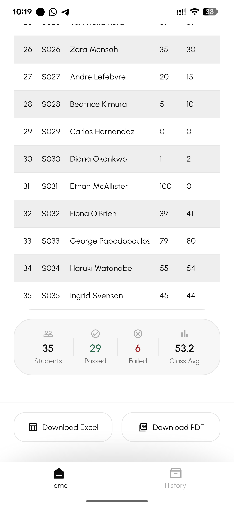

# Grady - Student Grade Calculator
Grady is a simple Flutter application designed to calculate and display student grades based on their scores. The app demonstrates the use of factory methods, interfaces, polymorphism, and inheritance to create a flexible and maintainable codebase.

## Architecture & Design Patterns

The project follows a clean and straightforward architecture, ensuring simplicity while adhering to good practices.

### Factory Methods & Interfaces
- **Interface (`GradeCalculator`):** Defined in `lib/services/grade_calculator.dart`, this abstract class mandates the contract for any grading implementation (calculating averages, assigning letter grades, etc.).
- **Factory Method:**
  - The `GradeCalculator` class exposes a factory constructor `factory GradeCalculator()`. This method encapsulates the instantiation logic, returning a `StandardGradeCalculator` by default.
  - The `Student` model (`lib/models/student.dart`) uses a `factory Student.fromMap(...)` constructor to create instances from JSON/Map data, centralizing the deserialization logic.

### Polymorphism
Polymorphism is demonstrated through the `GradeCalculator` architecture:
- **Interface-based Polymorphism:** The application code depends on the abstract `GradeCalculator` interface rather than a concrete implementation. This allows the underlying logic to be swapped (e.g., for different grading scales) without changing the consuming code.
- **Verification:** A specific test file `test/grade_calculator_test.dart` has been added to verify that different implementations of `GradeCalculator` can be used interchangeably, confirming true polymorphic behavior.

### Inheritance
Inheritance is used to promote code reuse and establish hierarchical relationships:
- **Test Implementation (`StrictGradeCalculator`):** In `test/grade_calculator_test.dart`, the `StrictGradeCalculator` class extends `StandardGradeCalculator`. It inherits the core traversal and averaging logic (code reuse) but overrides the specific `assignGrade` method to enforce a stricter grading scale (behavior modification).
- **Framework Inheritance:** The app naturally leverages Flutter's inheritance structure, where widgets like `GradeCalculatorApp` extend `StatelessWidget`, and `HomePage` extends `StatefulWidget`.
